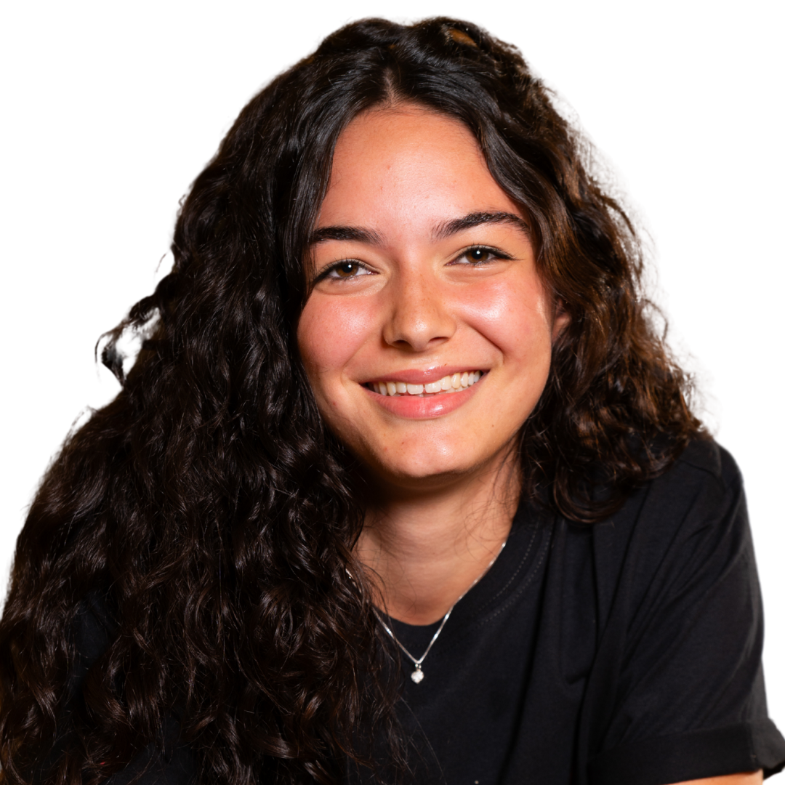
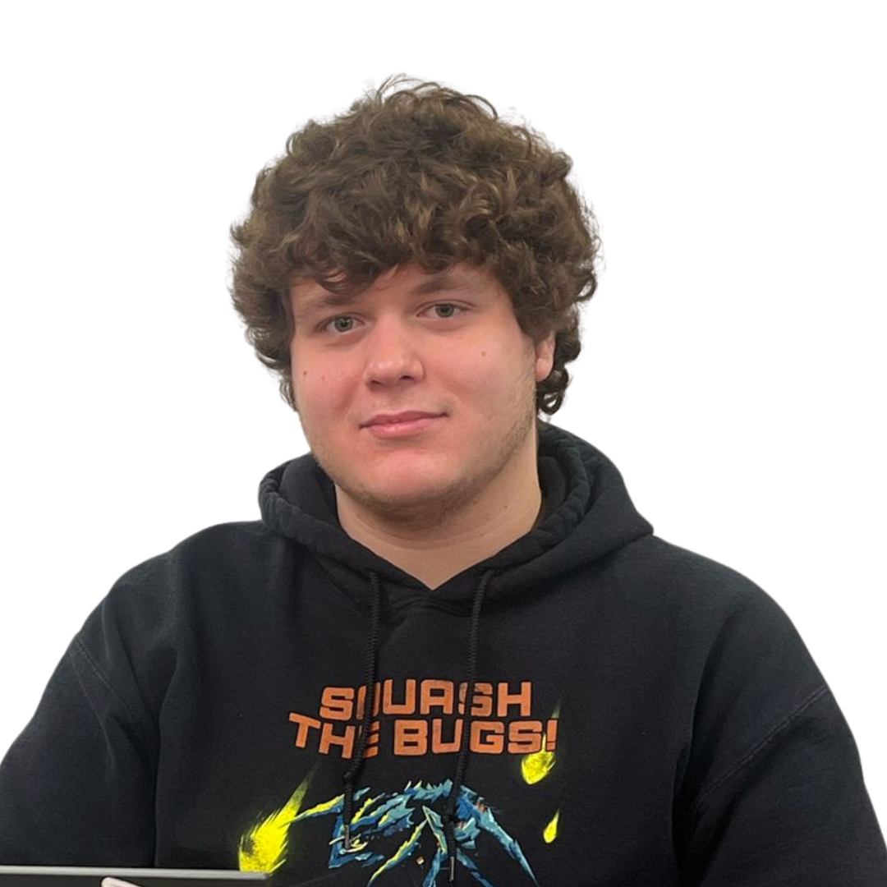
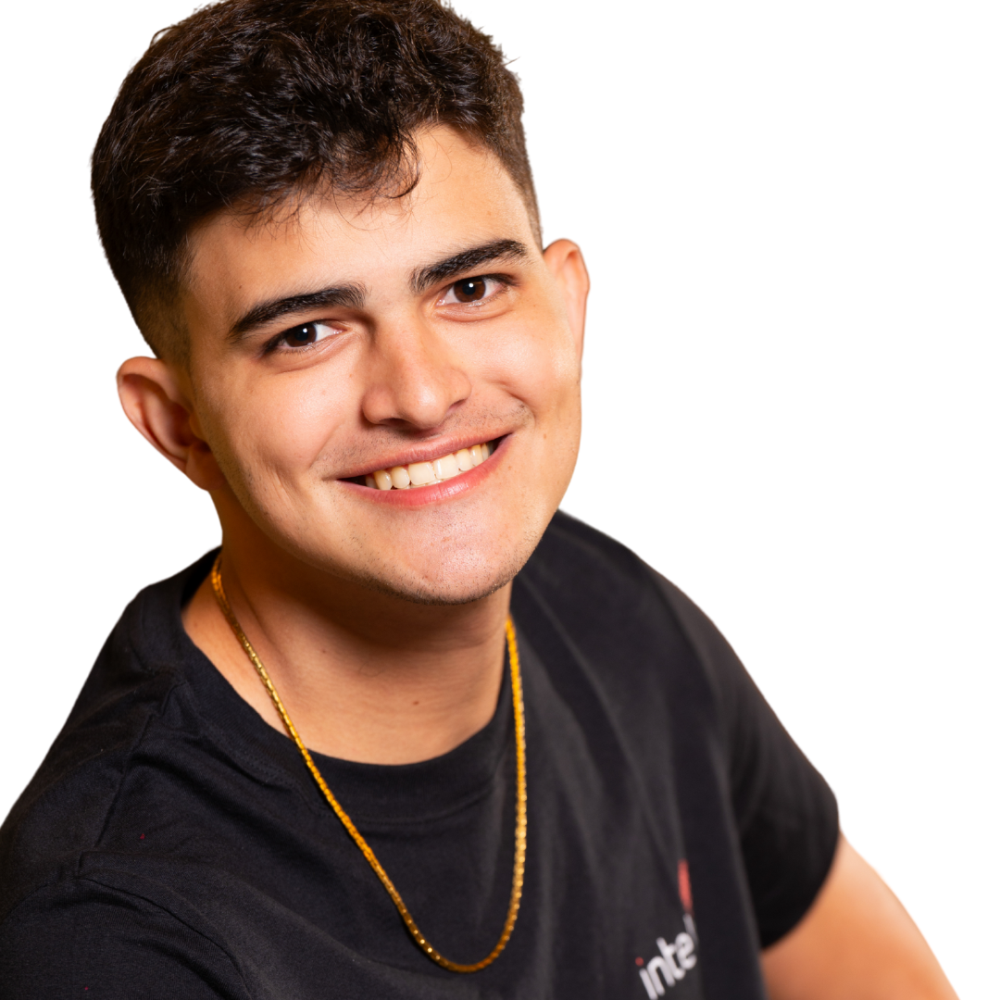

# SOD - Sistema Óptico de Detecção 🔍

## 🎥 Espaço reservado para o vídeo da solução

## 👥 Grupo - SOD

  
  

## 👨‍🎓 Integrantes: 

  <table>
    <tr>
      <td align="center">
        <a href="https://www.linkedin.com/in/davi-abreu-da-silveira/">
           
          <b>Davi Abreu</b>
        </a>
      </td>
      <td align="center">
        <a href="https://www.linkedin.com/in/iisabelledantas/">
           
          <b>Isabelle Dantas</b>
        </a>
      </td>
      <td align="center">
        <a href="https://www.linkedin.com/in/julia-lika-ishikawa">
           
          <b>Júlia Lika</b>
        </a>
      </td>
      <td align="center">
        <a href="https://www.linkedin.com/in/lucas-nepomuceno-ismart/">
           
          <b>Lucas Nepomuceno</b>
        </a>
      </td>
      <td align="center">
        <a href="https://www.linkedin.com/in/luizapetenazzi">
           
          <b>Luiza Petenazzi</b>
        </a>
      </td>
      <td align="center">
        <a href="https://www.linkedin.com/in/marcelo-c-3257702bb/">
           
          <b>Marcelo Conde</b>
        </a>
      </td>
      <td align="center">
        <a href="https://www.linkedin.com/in/pabloazevedo/">
           
          <b>Pablo Azevedo</b>
        </a>
      </td>
    </tr>
  </table>

## 👩‍🏫 Professores:

### Orientador(a) 
- [Rodrigo Mangoni Nicola](https://www.linkedin.com/in/rodrigo-mangoni-nicola-537027158/)

### Instrutores
- [Lisane Valdo](https://www.linkedin.com/in/lisane-valdo/)
- [Murilo Zanini de Carvalho](https://www.linkedin.com/in/murilo-zanini-de-carvalho-0980415b/)
- [Guilherme Cestari](https://www.linkedin.com/in/gui-cestari/)
- [Geraldo Magela Severino Vasconcelos](https://www.linkedin.com/in/geraldo-magela-severino-vasconcelos-22b1b220/)
- [Rodrigo Nicola](https://www.linkedin.com/in/rodrigo-mangoni-nicola-537027158/)
- [Filipe Gonçalves](https://www.linkedin.com/in/filipe-gon%C3%A7alves-08a55015b/)

## 📜 Descrição

O SOD (Sistema Óptico de Detecção) é uma solução desenvolvida para auxiliar na detecção automática e monitoramento de fissuras em edificações. Utilizando técnicas de processamento de imagens e inteligência artificial, o sistema identifica, analisa e monitora fissuras por meio de imagens capturadas por drones ou câmeras de alta resolução. 

## 📁 Estrutura de Pastas

A ser definida conforme o desenvolvimento do projeto.

## 💻 Execução do Projeto

A ser definida conforme o desenvolvimento do projeto.

## 🗃 Histórico de lançamentos

* 0.1.0 - 
    - Início do projeto

