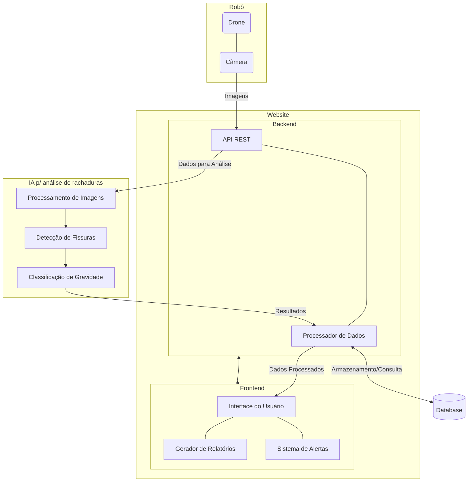

# Arquitetura Inicial

Para considerar a arquitetura inicial, toma-se como base a ideia de MVP do projeto, que consiste em quatro funções: detecção de fissuras em revestimentos de argamassa, interface para visualização das fissuras identificadas, geração de relatórios de forma automatizada sobre as fissuras, e um sistema de alertas para notificar sobre fissuras que demandam atenção imediata. 

Dessa maneira, a arquitetura inicial proposta foi estruturada de forma a atender de forma eficiente estes e outros requisitos, que podem ser consultados na seção de "Requisitos Funcionais". Além disso, ela foi estruturada em módulos, que serão detalhados adiante.

De forma resumida, tem-se o módulo de captura, constituído por drone equipado com câmera de alta resolução para aquisição das imagens das fachadas; (2) o sistema de inteligência artificial, responsável pelo processamento das imagens, detecção e classificação das fissuras quanto à sua gravidade; (3) o backend, que integra a API REST e o processador de dados, gerenciando o fluxo de informações e o armazenamento em banco de dados; e (4) o frontend, que disponibiliza a interface do usuário, o gerador de relatórios e o sistema de alertas.

## Módulos do Sistema
### Módulo de Captura de Imagens:

- Composto por um drone equipado com câmera para inspeção não invasiva de fachadas
- Responsável pela aquisição de imagens em diferentes ângulos e distâncias, garantindo cobertura adequada das áreas inspecionadas
- Permite operação autônoma ou controlada para captura sistemática de dados visuais

### Módulo de Inteligência Artificial:

- Realiza o processamento inicial das imagens captadas, aplicando técnicas de filtragem e melhoramento
- Implementa algoritmos específicos para detecção de fissuras, identificando padrões característicos destas patologias
- Classifica as fissuras detectadas quanto à sua gravidade, utilizando parâmetros como largura, comprimento e padrão de distribuição

### Módulo de Backend:

- API REST que gerencia as solicitações e o fluxo de dados entre os diferentes componentes do sistema
- Processador de Dados que implementa a lógica de negócio, organizando e preparando as informações para armazenamento e visualização
- Sistema de banco de dados para armazenamento estruturado dos resultados de análises, históricos e metadados das inspeções

### Módulo de Frontend:

- Interface do Usuário intuitiva para visualização das fissuras detectadas e seus detalhes
- Gerador de Relatórios que compila os dados de inspeção em documentos estruturados
- Sistema de Alertas que notifica os usuários sobre fissuras que ultrapassam limiares predefinidos de gravidade

## Fluxo do Sistema
O fluxo de processamento inicia-se com a captura de imagens pelo drone, que são então transmitidas para o backend do sistema via API REST. A partir daí, as imagens são encaminhadas para análise pelo módulo de IA, que executa o processamento, a detecção e a classificação das fissuras. Os resultados deste processamento retornam ao backend, onde são processados e armazenados no banco de dados.

O Processador de Dados, componente independente da API REST, organiza as informações recebidas, criando relações entre as fissuras detectadas, as imagens originais e os metadados da inspeção. Os dados processados são então disponibilizados para o frontend, onde são apresentados através da interface do usuário, gerando relatórios detalhados e alertas quando necessário.

## Interação Humana e Verificação Manual
Um aspecto dessa arquitetura que foi pensado pelo grupo e deve ser mencionado é a possibilidade de intervenção humana no processo de análise. Ele permite que o pesquisador do projeto possa realizar análises manuais de imagens nas quais a IA não alcançou um alto nível de acurácia. Esta característica é implementada através de uma interface específica no frontend, onde imagens com baixa confiabilidade de classificação são sinalizadas para revisão.

Essa arquitetura atende aos requisitos e necessidades do parceiro de forma eficiente. A representação dela pode ser encontrada no diagrama abaixo.

