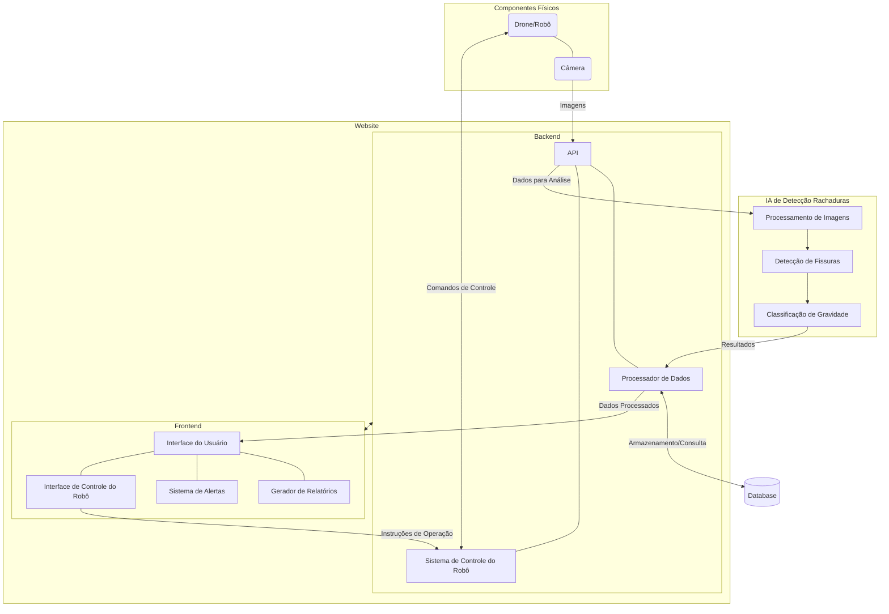

# Arquitetura Inicial

Apresenta a proposta arquitetural do sistema, descrevendo os módulos principais, suas responsabilidades, as interfaces entre componentes e as tecnologias previstas, acompanhada de diagramas explicativos.

