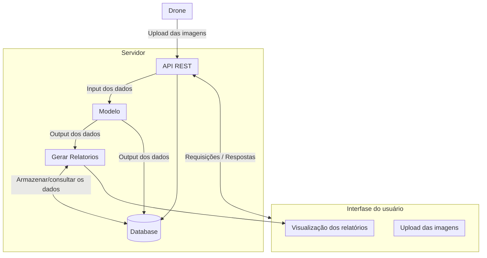

# Atualizações na Arquitetura

## Atualização da Arquitetura da Solução

&emsp; Na seção da [arquitetura inicial](/docs/docs/sprint-1/especificacoes-tecnicas/Arquitetura_Inicial.md), foi apresentada uma proposta para a estrutura da solução no estágio inicial do projeto. No entanto, com o avanço do entendimento das necessidades do sistema e a inclusão de novas funcionalidades, tornou-se necessária a atualização da arquitetura. A principal motivação para essa reestruturação foi a introdução do drone como fonte automatizada para a coleta de imagens.

&emsp; A arquitetura atual foi reorganizada em três blocos principais: front-end, servidor e dispositivos de captura de imagens O *front-end* abrange toda a interface com a qual o usuário interage, destacando-se os seguintes módulos: envio de imagens — sejam capturadas pelo drone ou por outros dispositivos —, visualização de relatórios gerados e acesso ao sistema de alertas em casos críticos. Além disso, o sistema permite a auditoria de casos em que a predição apresenta resultado inferior a 75%.

O servidor foi segmentado em três módulos independentes:

* **API**: responsável pela mediação das requisições e pelo armazenamento dos dados;

* **Modelo**: executa o processamento das imagens e a análise por meio de inteligência artificial;

* **Geração de Relatórios**: organiza os resultados de forma compreensível para o usuário final.

Todos os módulos do servidor se conectam a uma base de dados central, que funciona como repositório unificado das informações do sistema.

Portanto, a atualização da arquitetura proporcionou avanços nos aspectos de integração, automação e organização do sistema, com enfâse para a integração de drones na coleta de imagens. Assim, essas mudanças são essenciais para a continuidade e evolução do projeto.