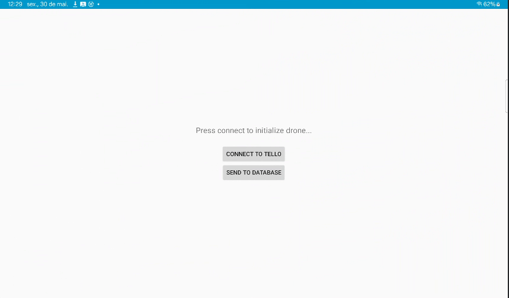

# Introdução ao Aplicativo
---
#

Este aplicativo foi desenvolvido com o objetivo de permitir o controle completo do drone DJI Tello e possibilitar sua integração com os nossos sistemas. A utilização do aplicativo oficial do Tello não atende a essa necessidade por limitações do proprio app.

Então através do uso do SDK do Tello, este app foi criado para oferecer controle total sobre o drone, recepção de vídeo ao vivo, e um caminho direto para acoplar funcionalidades como captura de imagens e envio para uma base de dados própria.

Essa versão do aplicativo ainda esta em desenvolvimento, portanto contem apenas interfaces básicas.

---

## Visão Geral

O aplicativo permite:

- Conexão com o drone via Wi-Fi usando comandos UDP.
- Controle de voo com joysticks virtuais (movimento e rotação).
- Decodificação e exibição do vídeo ao vivo transmitido pelo drone.
- Interface com botões para ações essenciais: decolagem, pouso, desconexão.
- Exibição em tempo real do status de Wi-Fi, nível de bateria, altura e velocidade.
- Captura de fotos e integração com banco de dados para envio.

---

## Tela Inicial

A tela inicial fornece duas opções ao usuário:

- **Connect to Tello**: Inicia a conexão com o drone portanto que esteja conectado ao Wi-Fi do drone, ao conectar, inicia o sistema de [Controle e Streaming](./Controle_e_Streaming.md).
- **Send to Database**: Permite o usuario fazer o [Envio de Imagens](./Envio_Imagens_Banco.md).