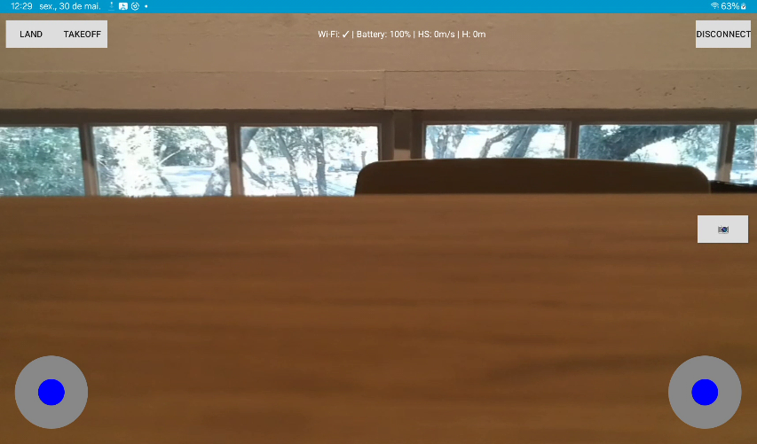

# Controle e Streaming
---

## Interface de Controle

Ao se conectar ao drone, o usuário é levado para a tela principal de controle. Essa interface contém:

- Vídeo ao vivo do drone em tempo real (`SurfaceView`).
- Dois joysticks virtuais para movimentação e rotação.
- Botões de decolagem (`Takeoff`), pouso (`Land`), desconexão (`Disconnect`) e um botão de captura (`Photo`) ainda não funcional.
- **Indicador de status** no topo com informações como:
  - Estado da conexão Wi-Fi com o drone.
  - Nível atual da bateria.
  - Altura (H) e velocidade horizontal (HS) do voo.

Screenshot tirada em um tablet.


---

## Estrutura do Código

A organização segue uma arquitetura modular e clara:

- `tellocontroller`: Lida com as atividades principais, envio de comandos e recepção de vídeo.
- `ui.theme`: Contém o joystick personalizado usado na interface de controle.
- `res/layout`: Define a interface gráfica em XML.

---

## Inicialização da Conexão

Na `MainActivity`, ao clicar em **Connect to Tello**, o app:

1. Envia o comando `"command"` para ativar o modo SDK do drone.
2. Envia `"streamon"` para iniciar a transmissão de vídeo.
3. Inicia a `ControlActivity` após a confirmação de conexão.

```kotlin
TelloCommandSender.sendCommand("command")
Thread.sleep(100)
TelloCommandSender.sendCommand("streamon")
````

Em caso de falha, é exibida uma mensagem de erro por `Toast`.

---

## Controle com Joysticks

Na `ControlActivity`, dois joysticks (`JoystickView`) controlam o drone:

* **Joystick esquerdo**: altura (vertical) e rotação (yaw).
* **Joystick direito**: movimento para frente/trás e lateral.

A cada 100ms, o app envia comandos RC no formato:

```
rc <left_right> <forward_back> <up_down> <yaw>
```

Botões adicionais:

* **Takeoff**: envia `takeoff`.
* **Land**: envia `land`.
* **Disconnect**: pousa o drone, encerra o vídeo e retorna à tela inicial.
* **Photo**: presente visualmente, será implementado em breve.

---

## Exibição do Vídeo

A classe `TelloVideoReceiver` trata a recepção e decodificação do vídeo transmitido pelo drone:

1. Recebe pacotes UDP com dados codificados em H.264.
2. Detecta NAL units para configurar o decoder (`MediaCodec`).
3. Exibe os frames decodificados no `SurfaceView`.

Trecho de configuração do codec:

```kotlin
val format = MediaFormat.createVideoFormat("video/avc", 960, 720)
format.setByteBuffer("csd-0", ByteBuffer.wrap(sps))
format.setByteBuffer("csd-1", ByteBuffer.wrap(pps))
decoder.configure(format, surface, null, 0)
```

Há também um mecanismo automático de recuperação após vários frames corrompidos.

---

## Indicadores de Status

Na parte superior da tela de controle, o app exibe:

* **Wi-Fi**: status de conexão com o drone.
* **Battery**: porcentagem da bateria do Tello.
* **HS (Horizontal Speed)**: velocidade horizontal atual.
* **H (Height)**: altura atual do drone.

Esses dados são atualizados conforme a transmissão e refletem informações cruciais durante o voo.

---

## JoystickView Personalizado

O componente `JoystickView` é uma `View` customizada que:

* Detecta o toque e calcula a posição relativa do usuário.
* Normaliza os valores de entrada entre -1 e 1.
* Atualiza a posição do controle visualmente.
* Retorna automaticamente ao centro ao soltar o toque.

---

## Funcionalidades Futuras

As próximas sprints incluem:

* Implementação completa da captura de fotos a partir do feed de vídeo.
* Melhorias da Interface/UX.

