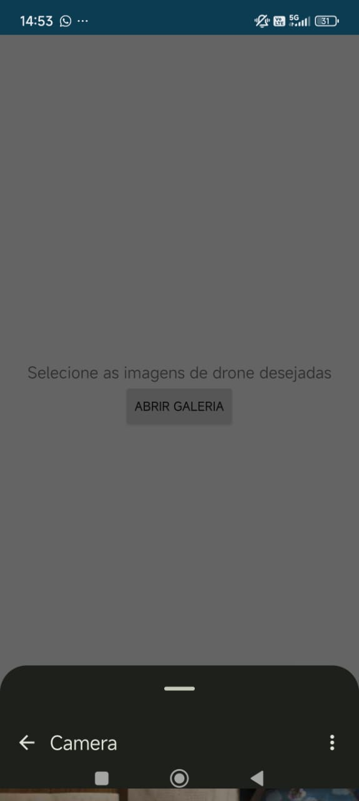

# Envio de imagens

## Interface de Inserção de Imagens 
Quando o usuário sair da tela principal e ir até a tela de envio de imagens, ele se deparará com um botão que abrirá a galeria nativa do celular e, a partir daí, ele poderá selecionar as imagens que deseja enviar para o banco de dados remoto para uma futura análise. 

## Estrutura do Código

A organização da funcionalidade segue a seguinte estrutura:

- `DatabaseSender`: permite que o usuário envie manualmente uma imagem armazenada no dispositivo para o banco de dados via Supabase. Ela representa uma atividade (Activity) com interface gráfica onde o usuário pode selecionar uma imagem da galeria.
- `SupabaseClient`: encapsula as operações de comunicação com o banco Supabase. Sua função é centralizar e abstrair a lógica de acesso à API REST do Supabase.
- `FileUtils`: possui algumas funções importantes utilizadas no `DatabaseSender`, como a extração de nome de arquivos a partir de URIs e a conversão para arquivos locais temporários, facilitando seu uso e envio.

---

## Funcionamento do Fluxo de Envio

1. **Permissões de acesso**:
   Ao abrir a `DatabaseSender`, o app verifica se o usuário concedeu permissão para acessar imagens armazenadas no dispositivo. Caso não tenha, ele solicita essa permissão dinamicamente, com suporte para diferentes versões do Android (TIRAMISU e anteriores).

2. **Seleção de imagem**:
   Quando o botão de envio é clicado, é aberta a galeria do dispositivo por meio do `ActivityResultLauncher`. O usuário então escolhe uma imagem, e o URI da imagem selecionada é capturado.

3. **Preparação do arquivo**:
   Com o URI em mãos, o `FileUtils.getPath()` é chamado para:

   * Extrair o nome do arquivo (`getFileName()`).
   * Criar uma cópia local do arquivo no cache do app (transformando o URI em caminho acessível no sistema de arquivos Android).

4. **Envio ao Supabase**:
   O `SupabaseClient.uploadImageAndInsertRecord()` realiza duas ações:

   * **Upload da imagem** para o armazenamento de objetos (bucket) do Supabase.
   * **Inserção de um registro** na tabela do banco de dados, incluindo metadados como o nome do arquivo e o caminho gerado.

5. **Feedback ao usuário**:
   Ao longo do processo, mensagens são exibidas via `Toast` para informar sobre o sucesso ou falha de cada etapa, proporcionando transparência e usabilidade.

---

## Aspectos importantes

* A funcionalidade ainda não oferece tratamento de múltiplas imagens por vez; o envio é unitário.
* O nome original da imagem é preservado, o que facilita o rastreamento posterior para análises.

---

## Funcionalidades Futuras

* Adicionar suporte a múltiplas imagens por envio.