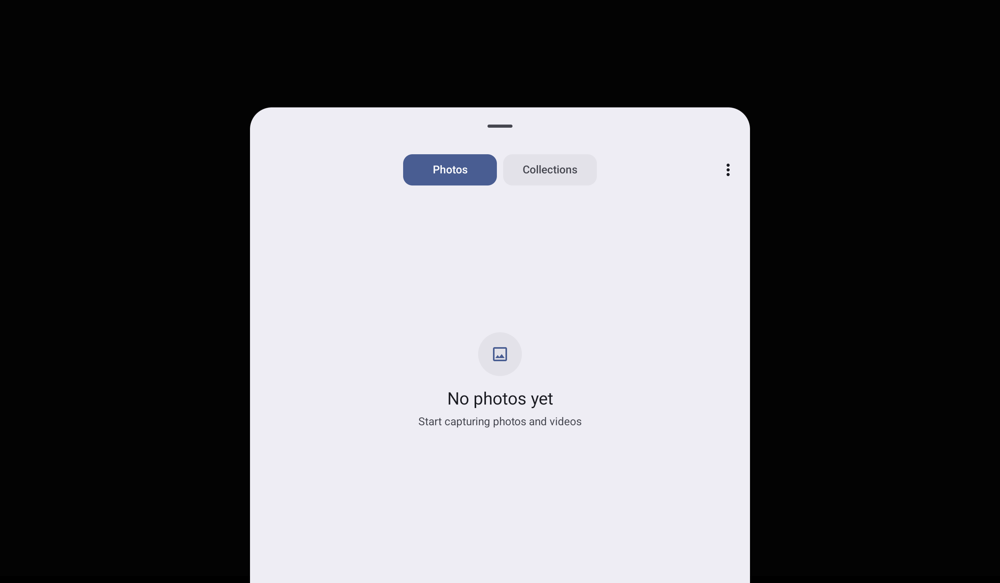

# Atualizações do Aplicativo de Controle do Drone
---

Esta versão do aplicativo Android recebeu diversas melhorias, tanto em termos de funcionalidades quanto na interface visual. As atualizações têm como objetivo proporcionar uma experiência pratica e intuitiva para os usuarios.

---

## Identidade Visual e Estilo Modernizado

O aplicativo passou por uma reformulação visual completa, alinhando-se a uma estética mais moderna, limpa e funcional. As mudanças incluem:

- Alteração para uma **paleta de cores escuras** para toda a interface, facilitando o uso em ambientes externos e com alto brilho.
- **Botões redesenhados** com **bordas arredondadas**, oferecendo uma experiência visual mais agradável.
- Inclusão do **logo oficial** do projeto SOD tanto na tela inicial quanto no ícone do app no launcher Android.

### Ícone do aplicativo no Android


O logo ja implementado no App para representar parte do produto SOD.

---

## Tela Inicial

A nova versão da tela inicial do aplicativo simplifica as os caminhos disponíveis para o usuário.


A tela contém:

- O logo centralizado, representando a identidade visual do projeto.
- Dois botões com estilo escuro e arredondado:
  - **Connect to Tello**: leva o usuário à tela de controle do drone.
  - **Image Upload**: leva o usuário para a interface de envio de imagens ao banco de dados remoto (via Supabase).

---

## Tela de Controle do Drone

A `ControlActivity` é o coração do app, onde o usuário pode comandar o drone em tempo real. A interface foi modernizada com o novo estilo visual e a adição de ícones nos joysticks.


### Elementos presentes:

- **Joysticks visuais** com ícones setoriais indicando direções de movimento e rotação.
- Botões para:
  - **Takeoff**
  - **Land**
  - **Disconnect**
  - **Photo** (captura de imagem)
- Barra de status com:
  - **Porcentagem da bateria**
  - **Intensidade do sinal Wi-Fi** do drone

---

## Implementação do Sistema de Captura de Fotos

Uma das principais novidades desta versão foi a **implementação completa da funcionalidade de captura de imagem** a partir do vídeo ao vivo do drone.

### Funcionamento:

1. O vídeo é exibido em um `TextureView`.
2. Quando o botão `Photo` é pressionado, o conteúdo atual do `TextureView` é transformado em um `Bitmap`.
3. O `Bitmap` é salvo no armazenamento interno do Android por meio da API `MediaStore`, garantindo que ele seja visível na galeria do dispositivo.
4. As imagens capturadas são armazenadas na pasta `Pictures/SOD`, com nomes no formato `Tello_YYYYMMDD_HHmmss.jpg`
(YYYY Sendo o Ano, MM o mes, DD o dia, HH a hora, MM os minutos e SS os segundos).


### Código simplificado do processo:

```kotlin
photoButton.setOnClickListener {
    val bitmap = textureView.bitmap
    if (bitmap != null) {
        saveBitmapToGallery(bitmap)
    } else {
        Toast.makeText(this, "Failed to capture frame", Toast.LENGTH_SHORT).show()
    }
}
```

### Função de salvamento:

```kotlin
private fun saveBitmapToGallery(bitmap: Bitmap) {
    val timestamp = SimpleDateFormat("yyyyMMdd_HHmmss", Locale.getDefault()).format(Date())
    val contentValues = ContentValues().apply {
        put(MediaStore.Images.Media.DISPLAY_NAME, "Tello_$timestamp.jpg")
        put(MediaStore.Images.Media.MIME_TYPE, "image/jpeg")
        put(MediaStore.Images.Media.RELATIVE_PATH, "Pictures/SOD")
        put(MediaStore.Images.Media.IS_PENDING, 1)
    }

    val uri = contentResolver.insert(MediaStore.Images.Media.EXTERNAL_CONTENT_URI, contentValues)

    uri?.let {
        contentResolver.openOutputStream(it)?.use { out ->
            bitmap.compress(Bitmap.CompressFormat.JPEG, 100, out)
        }
        contentValues.clear()
        contentValues.put(MediaStore.Images.Media.IS_PENDING, 0)
        contentResolver.update(uri, contentValues, null, null)

        runOnUiThread {
            Toast.makeText(this, "Photo saved to gallery in SOD", Toast.LENGTH_SHORT).show()
        }
    }
}
```

---

## Tela de Envio de Imagens

A interface de envio de imagens para o banco Supabase (`DatabaseSender`) foi adaptada ao novo estilo do aplicativo.


### Alterações:

* Estilo escuro e botões arredondados aplicados.
* Botão de retorno para a tela inicial.
* Verificação e solicitação de permissões de acesso ao armazenamento, com compatibilidade para Android 13+ (`READ_MEDIA_IMAGES`).

---

## Tela de Seleção de Imagens

Ao clicar em "Abrir Galeria", o app utiliza o `ActivityResultLauncher` para permitir a escolha de uma imagem.



* A imagem selecionada é enviada ao Supabase via `SupabaseClient.uploadImageAndInsertRecord()`.
* O nome da imagem original é preservado e armazenado junto aos metadados.

---

### Decisões Finais

Após diversas discussões no grupo de projeto, foi decidido que o **aplicativo será descontinuado** como parte principal do produto final. A funcionalidade de envio de imagens será migrada para o **site do sistema**, com **compatibilidade mobile**, facilitando a manutenção e integração da plataforma.

Alterações no App ainda podem ser feitas mas **não contabilizara como parte do produto final e sim como algo extra**.

---
